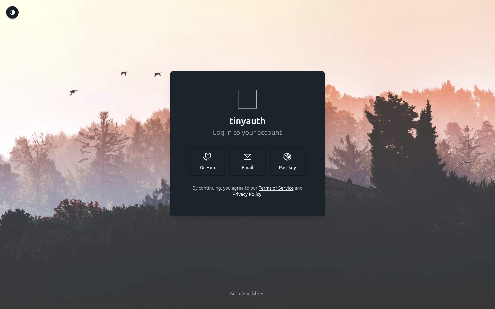

`Tinyauth`는 **오픈소스 인증 공급자(OIDC Provider)** 소프트웨어에요. 사용자 경험을 중심으로 설계되어 빠르고 편리한 로그인 여정을 제공하는 것을 목표로 두고 있어요.

단일 YAML 파일로 선언적으로 관리하며, 단일 Docker 컨테이너로 배포할 수 있어요. 별도의 데이터베이스 서버나 런타임 의존성 없이, SQLite만으로도 바로 시작할 수 있어요.

패스워드 인증은 물론, 패스키(WebAuthn), 소셜 로그인(GitHub·Google·Apple), TOTP 이중 인증, 이용약관 동의 관리, 34가지 테마, 다국어(한·영·일) 지원까지 — 단순하지만 완전한 인증 서버를 지향해요.

---

## 주요 기능

- **다양한 인증 방식**: 비밀번호, 패스키(WebAuthn/FIDO2), 소셜 로그인(Google, GitHub, Apple), 커스텀 OAuth
- **이중 인증(2FA)**: TOTP 기반 인증 앱 지원 (Google Authenticator, Authy 등)
- **표준 프로토콜**: OAuth 2.0 및 OpenID Connect (OIDC) 완벽 지원
- **PKCE 지원**: Authorization Code Flow + PKCE로 SPA와 모바일 앱 보안 확보
- **이용약관 관리**: 명시적/암시적 동의 플로우, 버전 관리 및 재동의 기능
- **다국어 지원**: 한국어, 영어, 일본어 기본 제공
- **34가지 테마**: daisyUI 기반의 라이트/다크 모드 및 다양한 테마
- **간편한 배포**: 단일 Docker 이미지, 단일 YAML 설정 파일
- **유연한 데이터베이스**: SQLite (기본) 또는 PostgreSQL
- **자동 키 관리**: RS256 JWT 서명 키 자동 생성 및 순환
- **오픈소스**: AGPL v3 라이선스, 무료, 엔터프라이즈 전용 기능 없음
